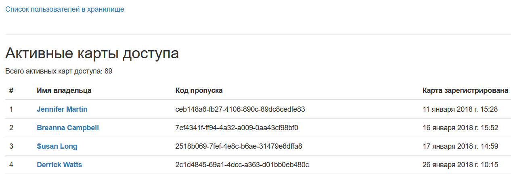
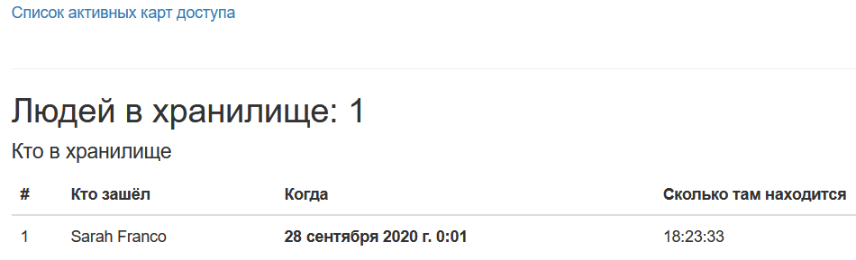
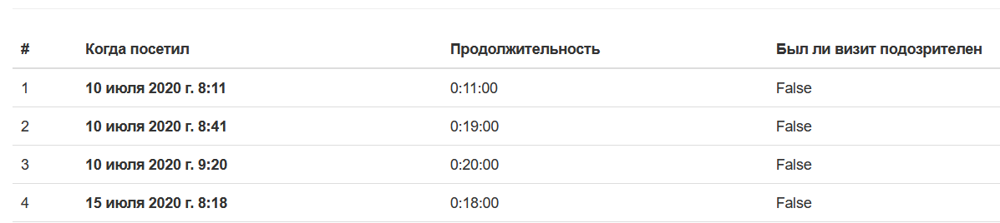

# Пульт охраны банка

[Devman](https://dvmn.org/modules/). Django ORM. Первый урок. Часть 2.

Сайт с таблицами пользователй, которые посещали банковское хранилище.

## Фронт проекта

Фронт взят [отсюда](https://github.com/dvmn-tasks/django-orm-watching-storage).

Список активных карт доступа на главной странице.

На странице `/storage_information` список пользователей, которые прямо сейчас находятся в хранилище.

В любого пользователя можно провалиться и увидеть список его посещений.

## Бэкенд проекта
Запросы к БД для вывода информации выполнены с помощью Django ORM.

## Запуск

Команды для запуска

`pip install -r requirements.txt`

`python main.py`

Перейти на http://127.0.0.1:8000
